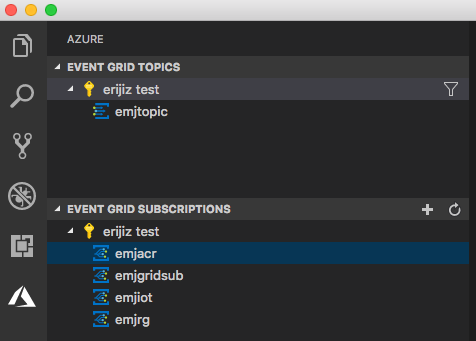
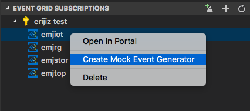
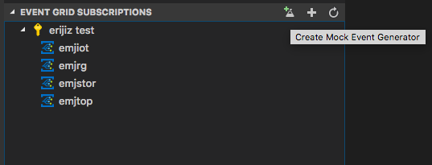
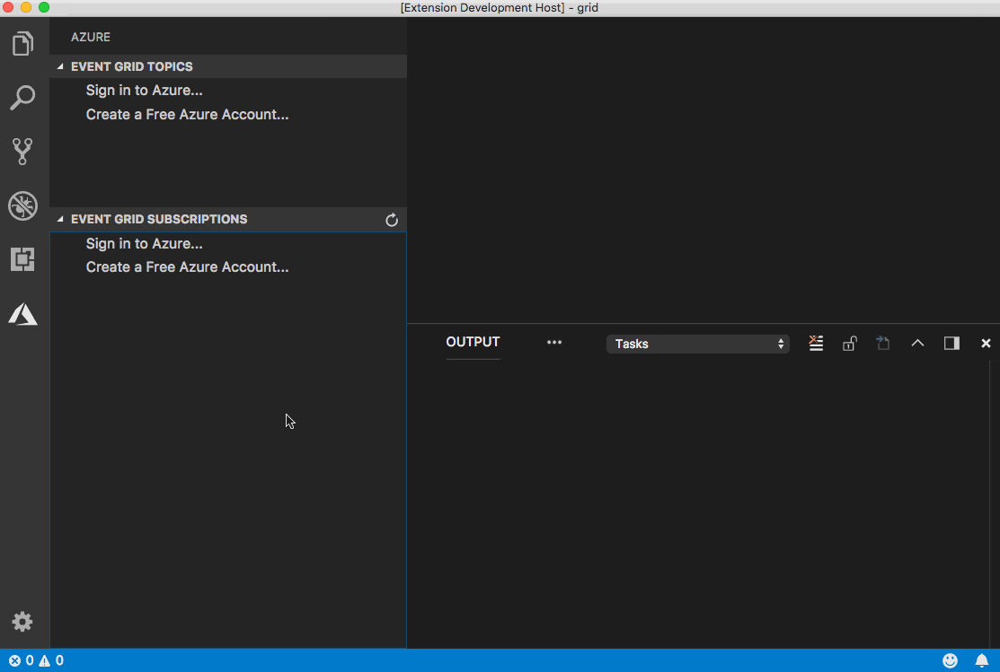
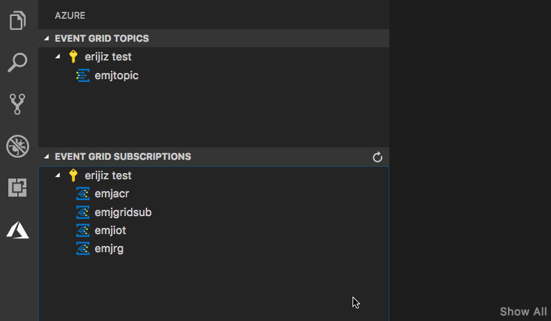

# Azure Event Grid for Visual Studio Code (Preview)

 

## Features

### Event Grid Explorers

* Create and delete Event Grid resources
* View Event Grid resources and open directly in the portal

### Generate Mock Events

This extension makes it easy to generate and send mock events to your Event Grid subscriptions. It leverages [json-schema-faker](https://github.com/json-schema-faker/json-schema-faker/blob/master/README.md) to automatically generate mock data from a json schema. If you have an existing Event Subscription, you can right click on that resource and select 'Create Mock Event Generator'. You may also select 'Create Mock Event Generator' from the title bar if you want to send events of any type to an arbitrary endpoint.

A json file with the following properties will be created:

* destination: The destination to use when sending events. The endpointUrl can be specified directly, or you can specify the id of an Event Subscription and the endpointUrl will be automatically determined for that resource.
* numberOfEvents: The number of events to generate and send.
* jsonSchemaFakerOptions: The [options](https://github.com/json-schema-faker/json-schema-faker/blob/master/README.md#custom-options) to pass in to json-schema-faker.
* schema: The JSON schema for your specific event, with additional metadata on how to generate mock data. You may use the [standard keywords](https://github.com/json-schema-faker/json-schema-faker/blob/master/README.md#supported-keywords) supported by json-schema-faker or [Chance.js](https://github.com/json-schema-faker/json-schema-faker/blob/master/README.md#advanced-usage-of-fakerjs-and-chancejs) for more advanced scenarios.

Once you have an event generator, you can customize the schema, select "Preview Events" to see what gets generated, and select "Send Events" to send generated events to your Event Subscription's endpoint.

## Managing Azure Subscriptions

If you are not signed in to Azure, you will see a "Sign in to Azure..." link. Alternatively, you can select "View->Command Palette" in the VS Code menu, and search for "Azure: Sign In".

If you don't have an Azure Account, you can sign up for one today for free and receive $200 in credits by selecting "Create a Free Azure Account..." or selecting "View->Command Palette" and searching for "Azure: Create an Account".

You may sign out of Azure by selecting "View->Command Palette" and searching for "Azure: Sign Out".

To select which subscriptions show up in the extension's explorer, click on the "Select Subscriptions..." button on any subscription node (indicated by a "filter" icon when you hover over it), or select "View->Command Palette" and search for "Azure: Select Subscriptions". Note that this selection affects all VS Code extensions that support the [Azure Account and Sign-In](https://github.com/Microsoft/vscode-azure-account) extension.

## Contributing

There are a couple of ways you can contribute to this repo:

* **Ideas, feature requests and bugs**: We are open to all ideas and we want to get rid of bugs! Use the Issues section to either report a new issue, provide your ideas or contribute to existing threads.
* **Documentation**: Found a typo or strangely worded sentences? Submit a PR!
* **Code**: Contribute bug fixes, features or design changes:
  * Clone the repository locally and open in VS Code.
  * Install [TSLint for Visual Studio Code](https://marketplace.visualstudio.com/items?itemName=eg2.tslint).
  * Open the terminal (press `CTRL+`\`) and run `npm install`.
  * To build, press `F1` and type in `Tasks: Run Build Task`.
  * Debug: press `F5` to start debugging the extension.

### Legal

Before we can accept your pull request you will need to sign a **Contribution License Agreement**. All you need to do is to submit a pull request, then the PR will get appropriately labelled (e.g. `cla-required`, `cla-norequired`, `cla-signed`, `cla-already-signed`). If you already signed the agreement we will continue with reviewing the PR, otherwise system will tell you how you can sign the CLA. Once you sign the CLA all future PR's will be labeled as `cla-signed`.

### Code of Conduct

This project has adopted the [Microsoft Open Source Code of Conduct](https://opensource.microsoft.com/codeofconduct/). For more information see the [Code of Conduct FAQ](https://opensource.microsoft.com/codeofconduct/faq/) or contact [opencode@microsoft.com](mailto:opencode@microsoft.com) with any additional questions or comments.

## Telemetry

VS Code collects usage data and sends it to Microsoft to help improve our products and services. Read our [privacy statement](https://go.microsoft.com/fwlink/?LinkID=528096&clcid=0x409) to learn more. If you don’t wish to send usage data to Microsoft, you can set the `telemetry.enableTelemetry` setting to `false`. Learn more in our [FAQ](https://code.visualstudio.com/docs/supporting/faq#_how-to-disable-telemetry-reporting).

## License

[MIT](LICENSE)
